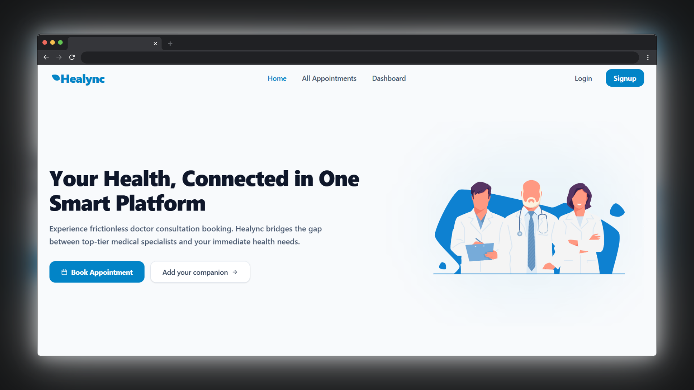

# Healync - Doctor Appointment Platform

Healync is a full-stack doctor appointment booking platform that streamlines
specialist discovery and consultation scheduling, replacing manual hospital
visits with a digital-first patient experience.

## ✨ Key Features

- **Specialist Discovery** - Users can browse verified specialists across
  multiple medical fields and book appointments directly through the platform.
- **Medical Companion** - Patients can request a trained Medical Companion to
  accompany them during hospital visits, tests, and prescriptions for added
  support.
- **Appointment Dashboard** - Patients can view all their booked appointments,
  cancel within the allowed window, and reschedule to a different time slot with
  ease.
- **Health Tips** - Delivers curated daily health tips covering nutrition,
  vision care, bone health, and lifestyle habits to promote preventive
  healthcare awareness.

## 👥 Who Is It For?

Healync is built for patients who find traditional hospital booking systems slow
and confusing - especially **elderly individuals** who need extra support during
visits, **busy professionals** who want to manage appointments digitally without
phone calls, and **health-conscious users** looking for a proactive approach to
preventive care.

## 🛠️ Tech Stack

## 🔗 Links

